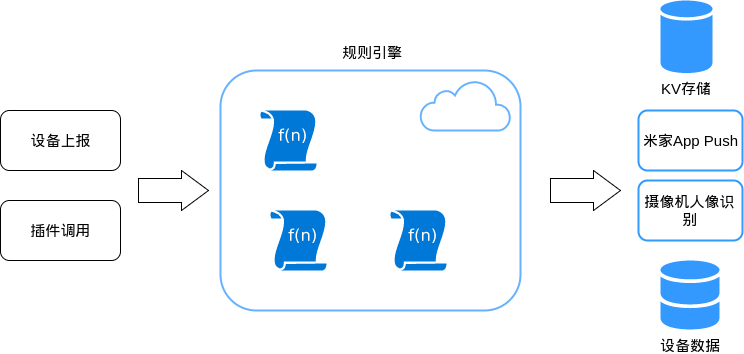

# 规则引擎

## 简介
规则引擎是miot提供的serverless的框架，支持厂商在miot平台自定义功能逻辑。  
厂商不不需要自己维护服务器、开发加解密逻辑与miot对接，直接提供以函数为单位的逻辑到miot平台，规则引擎负责权限验证、扩容、监控。在函数里，可以直接调用miot提供的服务，接收用户、设备上报的数据，处理之后选择发送Push或者存储到miot提供的存储中去。函数托管在miot提供的机器上。
规则引擎需要由一个事件触发函数的执行，目前支持的触发有: (`如果需要更多事件请与我们联系`)
* 设备上报事件、属性
* 米家App插件进行调用

触发函数之后可以调用miot开放的接口来执行自己的业务逻辑，开放的功能包括：
* 厂商独立的Key-Value存储
* 获取设备状态、历史上报信息
* 推送Push消息到米家App
* 发送到摄像头人像识别模块



目前支持golang语言。

## 示例

### 设备上报AQI大于100时推送通知用户
1. 定义一个model=$model, attr=prop.aqi的触发
2. 编写函数代码：
```
// 发推送示例
package main

import "github.com/aiquestion/go-simplejson"
import "strconv"

func handle(event map[string]interface{}, context map[string]interface{}) (interface{}, error){
	data := simplejson.From(event)
	aqi := data.Get("data").Get("status").MustInt()
	if aqi < 100 {
		return nil, nil
	}
	err := miot.DeviceEventPush(
		data.Get("token").MustString(),
		data.Get("data").Get("did").MustString(),
		data.Get("data").Get("attr").MustString(),
		"_DEVICE_NAME_",
		"aqi超过100",
		false,
		"",
		strconv.Itoa(aqi),
		map[string]interface{}{
			DEVICEEVENTPUSH_EXTRA_CONTENT_LOCALE_MAP: map[string]string{
				LOCALE_ZH_CN: "aqi超过100",
				LOCALE_EN: "aqi above 100",
			},
		})
	if err != nil {
		return nil, err
	}
	return "ok", nil
}


```
3. 测试，执行。

## 触发参数
### 设备事件触发
```
# prop
{
    "token": "xxxx", // 请求token，调用miot API时需要
    "data":{
        "did": "12941756",
        "uid": 49057842,
        "model": "mijia.airpurifier.v1",
        "pd_id": 999,
        "attr": "prop.aqi",
        "status": 100,
        "last_status": 100 // 设备上次上报的值
    }
}
# event 
{
    "token": "xxxx", // 请求token，调用miot API时需要
    "data":{
        "did": "12941756",
        "uid": 49057842,
        "model": "mijia.camera.v1",
        "pd_id": 999,
        "attr": "event.motion",
        "status": ["mp4 fds object name", "jpg fds object name"]
    }
}
```
### 插件调用
```
{
    "token": "xxxx", // 请求token，调用miot API时需要
    "data":{
        ...//这个json object是插件传上来的
    }
}
```

## 函数能调用的Miot能力
### 设备事件推送
* 会推送到米家App的消息通知栏
* 会按设备显示在米家App的消息中心里
* 根据用户消息中心的“设备推送”是否开启，选择是否要推送消息栏通知
```
miot.DeviceEventPush(
    token string, // 调用token，从请求获得
    did string, // 设备did
    attr string, // 事件、属性名 “prop.aqi” "event.motion"
    title string, // 推送的标题,占位符“_DEVICE_NAME_”会替换为设备名称
    content string, // 推送的内容
    push_share bool, // 是否推送设备分享的用户
    sound string, // 推送的铃声 “alarm”时为报警铃音
    value string, // json encode的status字段，会透传给米家App，插件可以获取到这个字段
    extra map[string]string // 保留
    )
```
### 存储、读取设备的Key-Value存储
* 数据存储在miot的kv存储中
* 设备解绑时会将数据删除
* app/设备可以自己获取
* 用来存储设备的配置信息
```
miot.SetDeviceExtraData(
    token string,
    did string,
    key string,
    value string,
)
miot.GetDeviceExtraData(
    token string,
    did string,
    key string,
)
```
### 读取设备当前状态
* 存储设备最新上报的一条event或者状态，多次上报同一个状态只保存最后一条
* 用来判断设备状态
```
miot.GetDeviceProps(
    token string,
    did string,
    propNames []string,
)
miot.GetDeviceEvents(
    token string,
    did string,
    eventNames []string,
)
```
### 读取设备SDS中存储的历史数据
* 设备的每条事件、属性都会按时间存储在sds中，读取时type=prop|event(分别是属性和事件) key=属性or事件名 time=上报时间戳
* 时间戳单位是秒
* 插件可以通过get_user_device_data和规则引擎里一样查询sds的数据
```
miot.GetSdsData(
    token string,
    data *SdsDataKey,
)
miot.SetSdsData(
    token string,
    data *SdsData,
)
miot.ScanSdsData(
    token string,
    data *SdsDataScanRequest,
)
```

* 示例
```
package main

import (
	"github.com/aiquestion/go-simplejson"
	"time"
	"strconv"
)

func handle(event map[string]interface{}, context map[string]interface{}) (interface{}, error) {
	eventJs := simplejson.From(event)
	data := eventJs.Get("data")
	if data.Get("attr").MustString() == "prop.aqi" {
		ct := time.Now()
		hour_start := time.Date(ct.Year(), ct.Month(), ct.Day(), ct.Hour(), 0, 0, 0, time.Local)
		// 推荐，每个事件上报1次读2次写。
		total_data, err := miot.GetSdsData(eventJs.Get("token").MustString(), &SdsDataKey{
			Did:   data.Get("did").MustString(),
			Type:  "prop",
			Key:   "aqi_average",
			Time:  hour_start.Unix(),
		})
		if err != nil {
			return nil, err
		}
		// no data set yet
		sum := int64(0)
		if total_data != nil && total_data.Did != "" {
			if v, err := strconv.ParseInt(total_data.Value, 10, 64); err == nil {
				sum = v
			}
		}
		sum += data.Get("status").MustInt64()

		// 不推荐！！！会造成每小时结束的时候sds访问量很大！！！
		// 仅是个示例
		//hour_datas, err := miot.ScanSdsData(eventJs.Get("token").MustString(), &SdsDataScanRequest{
		//	Did:       data.Get("did").MustString(),
		//	Type:      "prop",
		//	Key:       "aqi",
		//	TimeStart: hour_start.Unix(),
		//	TimeEnd:   ct.Unix(),
		//	Limit:     100, // if we got more than 100 items, just throw others
		//})
		//if err != nil {
		//	return nil, err
		//}
		//
		//// cal average data
		//sum := int64(0)
		//
		//for _, d := range hour_datas {
		//	if v, err := strconv.ParseInt(d.Value, 10, 64); err == nil {
		//		sum += v
		//	}
		//}

		err = miot.WriteSdsData(data.Get("token").MustString(), &SdsData{
			Did:   data.Get("did").MustString(),
			Type:  "prop",
			Key:   "aqi_average",
			Time:  hour_start.Unix(),
			Value: strconv.FormatInt(sum, 10),
		})
		if err != nil {
			return nil, err
		}
	}
	return "ok", nil
}
```

### 调用人脸识别功能
* 只有接入米家摄像机云存功能的设备可以使用该接口
* 识别人脸是异步流程，调用接口只触发识别，识别结果会以设备事件形式回调

```
miot.FaceAnalyse(
token string,
file_id string,  // 云存上传视频\图片后获取的文件id
content_type int64 // 0-image 1-video
extra_info string // 人脸识别部分会在识别结果中携带extra_info回来，可以用来做映射
)

miot.GetFaces(
token string,
did   string,
face_ids []string //人脸识别信息id
)

返回 FaceInfoMeta列表

type FaceInfoMeta struct {
  	FaceIdStr        string   `json:"faceIdStr"`
  	Score            *float64 `json:"score,omitempty"`
  	Age              *int32   `json:"age,omitempty"`
  	AgeConfidence    *float64 `json:"ageConfidence,omitempty"`
  	Gender           *int32   `json:"gender,omitempty"`
  	GenderConfidence *float64 `json:"genderConfidence,omitempty"`
  	WearGlasses      *bool    `json:"wearGlasses,omitempty"`
  	FigureInfo       *string  `json:"figureInfo,omitempty"`
  	OrgPhoto         []byte   `json:"orgPhoto,omitempty"`
  	Found            *bool    `json:"found,omitempty"`
}
```

* 示例
```
package main

import "github.com/aiquestion/go-simplejson"

func handle(event map[string]interface{}, context map[string]interface{}) (interface{}, error) {
	eventJs := simplejson.From(event)
	data := eventJs.Get("data")
	token := eventJs.Get("token").MustString()
	switch  data.Get("attr").MustString() {
	case "event.third_part_file_upload":
		sw, err := miot.GetDeviceExtraData(token, data.Get("did").MustString(), "switch_enable_face_detection")
		if err != nil {
			return nil, err
		}
		if sw == "" || sw == "true" {
			fileId := data.Get("data").Get("status").Get("thirdpartSegment").Get("fileId").MustString()
			err = miot.FaceAnalyse(token, data.Get("did").MustString(), fileId, 1/*video*/, "extra_info")
			if err != nil {
				return nil, err
			}
		}
	case "event.camera_face_detection":
		faces := data.Get("data").Get("status").Get("faceInfoMetas").MustArray()
		if len(faces) > 0 {
			valStr, _ := data.Get("status").Encode()
			// ignore err here , just try your best
			miot.DeviceEventPush(
				token,
				data.Get("did").MustString(),
				data.Get("attr").MustString(),
				"_DEVICE_NAME_", // 会替换成真实的设备名字
				"有人在门口移动",
				true,
				"",
				string(valStr),
				nil)
			// ... do other things
		}
	}
	return "ok", nil
}
```

### 属性上报功能
* 支持设备上报属性事件
```
miot.ReportEvent(
token string,
did string,
info []*Eventinfo
)

type Eventinfo struct {
	Attr      string `json:"attr"`
	Value     string `json:"value"`
	Timestamp *int64 `json:"timestamp,omitempty"`
}
```

* 示例
```
package main

import (
	"github.com/aiquestion/go-simplejson"
	"time"
)

func handle(event map[string]interface{}, context map[string]interface{}) (interface{}, error) {
	eventJs := simplejson.From(event)
	data := eventJs.Get("data")
	token := eventJs.Get("token").MustString()
	if data.Get("attr").MustString() == "prop.aqi" {
		if data.Get("status").MustInt64() > 100 && data.Get("last_status").MustInt64() < 100 {
			currentTime := time.Now().Unix()
			miot.ReportEvent(token, data.Get("did").MustString(), []*Eventinfo{
				{
					Attr:"event.air_alert",
					Value: "",
					Timestamp: &currentTime,
				},
			})
		}
	}
	return "ok", nil
}
```

### 通知当前设备
```
只允许给当前设备发送rpc，一次“函数”调用只能触发一次rpc
制定rpc的时候请小心，不要出现 event A 触发rpc B，设备在收到rpc B的时候又回上报event A的死循环
```
* 给设备发送rpc
```
miot.RpcDevice(token, did string, method string, params *simplejson.Json) (*RpcResult, error) 

type RpcResult struct {
	Code    int64            `json:"code"`
	Message string           `json:"message"`
	Result  *simplejson.Json `json:"result"`
}
```

## 创建流程
目前还没有界面可以使用，请邮件发送代码给米家服务器联系人来上传代码。
